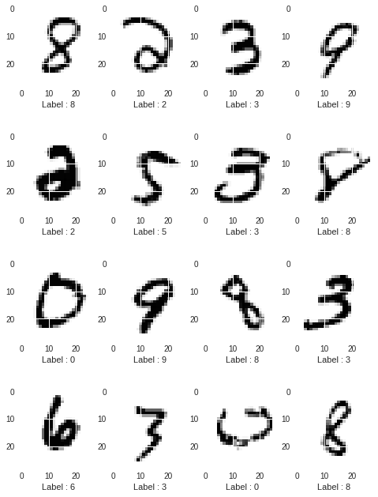
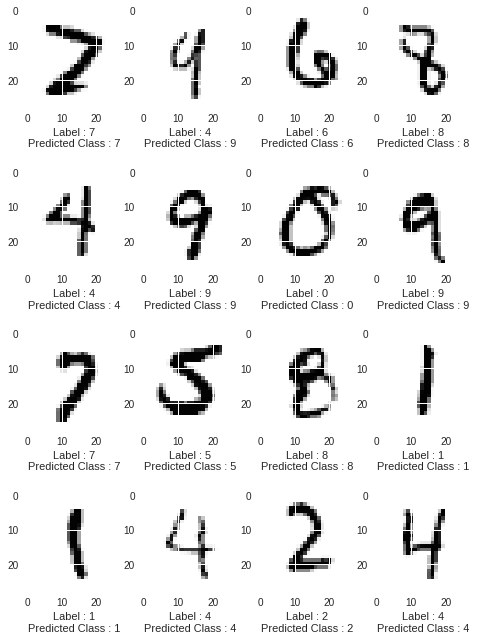

# MNIST-Classifier

### [MNIST Dataset](http://yann.lecun.com/exdb/mnist/)

MNIST dataset has 28x28 grayscale images of digits 0-9. The dataset has 60000 training images and 10000 testing images.

### Implementation

## 1. Pytorch

[IPython Notebook](MNIST_Classifier_PyTorch.ipynb) 

Model : Input(28x28x1) -> Conv1(28x28x4) -> ReLU(28x28x4) -> Conv2(28x28x8) -> ReLU(28x28x8) -> Max_Pool1(14x14x8) -> Conv3(14x14x16) -> ReLU(14x14x16) -> Conv4(14x14x32) -> ReLU(14x14x32) -> Max_Pool2(7x7x32) -> Fully_Connected_Layer1(1000) -> ReLU(1000) -> Fully_Connected_Layer2(10) 

Kernel size: 5 

Padding : 2 

Stride : 1 

Pool size : 2 

Pool Stride : 2 

Batch Size : 128 

GPU use: No 

Iterations : 4300 

Test set Accuracy : 98.12% 

## 2. Tensorflow

# 2.a. Standard CNNs

[IPython Notebook](MNIST_Classifier_Tensorflow.ipynb) 

Model: Input(28x28x1) -> Conv1(28x28x4) -> ReLU(28x28x32) -> Max_Pool1(14x14x32) -> Conv2(14x14x64) -> ReLU(14x14x64) -> Max_Pool2(7x7x64) -> Fully_Connected_Layer1(1024) -> ReLU(1024) -> Dropout(1024) -> Fully_Connected_Layer2(10)
Kernel size: 5 

Padding : 2 

Stride : 1 

Pool size : 2 

Pool Stride : 2 

Dropout Rate : 0.4 

Batch Size : 128 

GPU used : No 

Iterations : 4300 

Global Steps/sec : 2 

Test set Accuracy : 97.99% 

# 2.b. Depthwise Separable CNNs

-Inspired from [MobileNet](https://arxiv.org/abs/1704.04861) 

[Summary Of MobileNet and Depthwise Convolutions](MobileNet_Summary.pdf) 

-Used Depthwise Sepereable Convolutions instead of Standard Convolutions 

-Model is 3 times faster (Global steps/sec = 6 and time/100 steps = 20 sec) 

-A slight accuracy drop of 1.5% 

[IPython Notebook](MNIST_Classifier_MobileNet_Tensorflow.ipynb) 

Model: Input(28x28x1) -> Depthwise_Separable_Conv1(28x28x4) -> ReLU(28x28x32) -> Max_Pool1(14x14x32) -> Depthwise_Separable_Conv2(14x14x64) -> ReLU(14x14x64) -> Max_Pool2(7x7x64) -> Fully_Connected_Layer1(1024) -> ReLU(1024) -> Dropout(1024) -> Fully_Connected_Layer2(10) 

Kernel size: 5 

Padding : 2 

Stride : 1 

Pool size : 2 

Pool Stride : 2 

Dropout Rate : 0.4 

Width Multiplier : 1 

Resolution Multiplier : 1 

Batch Size : 128 

GPU used : No 

Iterations : 4300 

Global Steps/sec : 6 

Accuracy : 96.5% 

  

